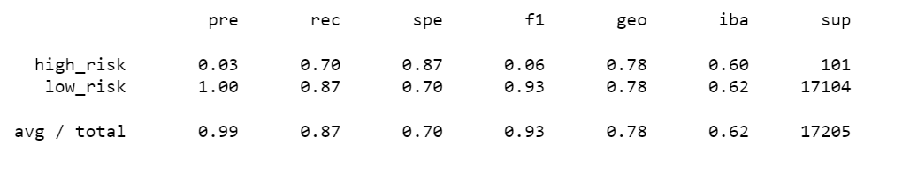
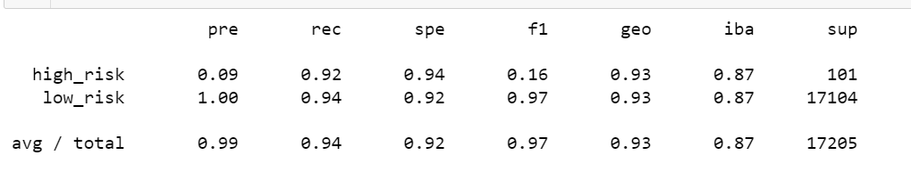
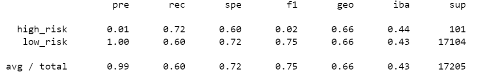
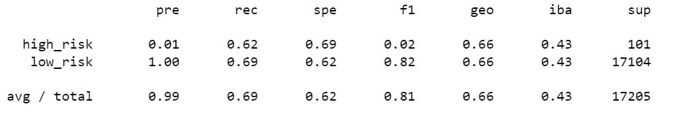
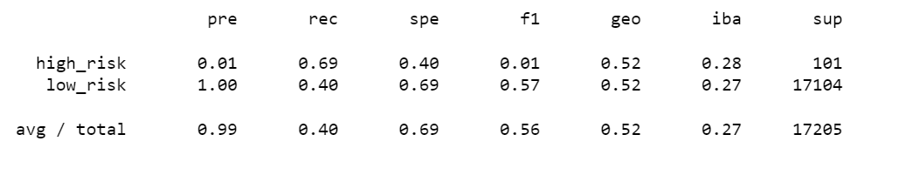
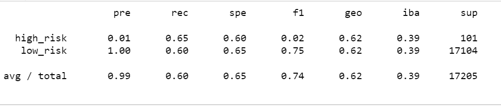

# Credit_Risk_Analysis

## Overview
Use supervised machine leaning to identify high rish credit applications using different models.

## Result

### Ensemble Learners
compare two ensemble algorithms to determine which algorithm results in the best performance. 

#### Balanced Random Forest Classifier

  

#### Easy Ensemble AdaBoost Classifier

  

### Oversampling
compare two oversampling algorithms to determine which algorithm results in the best performance

#### Naive Random Oversampling

  

#### SMOTE Oversampling

 

### Undersampling 
test an undersampling algorithms to determine which algorithm results in the best performance compared to the oversampling algorithms above

 

### Combination (Over and Under) Sampling 
test a combination over- and under-sampling algorithm to determine if the algorithm results in the best performance compared to the other sampling algorithms above

## Sumary

the models used to preform the credit risk analysis shows week precision in dertermine whether a credit application is high risk. the Easy Ensemble Classifier method is recomended as it have the highest accuracy rate of 87%, well most other models are below 50% accuracy.